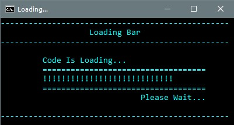

# Loading Bar ~ Windows Batch File

Simple loading baar with batchfile. Feel free to use the code in your batch file. Happy Coding!



### Custom Configuration
-----------------------------
You can also set your own symbol for loading bar other than exclamation mark (!). Find a below line in batch file and replace exclmation mark with your symbol. e.g. changing it to #

```
set probar=%probar%!!!!!!!
```
Updated line for Hash (#) would be
```
set probar=%probar%#######
```
